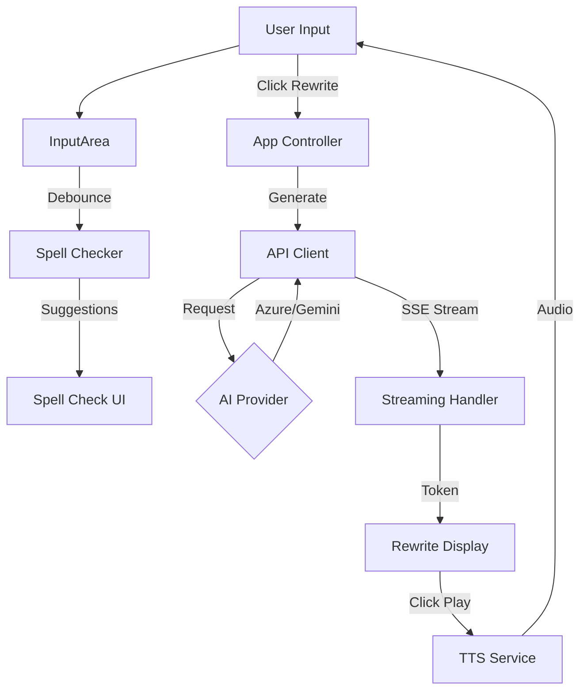

# Writing Flow — AI Writing Assistant

A lightweight web app that helps non-native English speakers improve their workplace communication with AI-powered rewriting and local spell checking.

## Features

- **3 Rewrite Styles**: Email, Teams Chat, Speaking
- **Local Spell Check**: 50,000-word dictionary with smart suggestions
- **Multi-Provider Support**: Azure Foundry (OpenAI-compatible) + Google Gemini
- **Text-to-Speech**: Practice pronunciation with built-in TTS
- **Streaming Responses**: Real-time text generation
- **Dark Theme**: Professional UI with gradient accents

## Setup

1. **Clone the repository**
   ```bash
   git clone https://github.com/mandowa/tiny_rewrite.git
   cd tiny_rewrite
   ```

2. **Configure API Keys**
   ```bash
   cp config.example.js config.js
   ```
   
   Edit `config.js` and add your API keys:
   - Azure Foundry: Your OpenAI-compatible endpoint + API key
   - Google Gemini: Get free key from [Google AI Studio](https://aistudio.google.com/apikey)

3. **Open in Browser**
   ```bash
   open index.html
   ```
   
   Or use a local server:
   ```bash
   python -m http.server 8000
   # Visit http://localhost:8000
   ```

## Usage

1. Type or paste your text (max 200 characters)
2. Select rewrite style(s): Email, Teams, or Speaking
3. Click **Rewrite** or press `⌘+Enter`
4. Copy results or use TTS to hear them

### Spell Check

- Automatically checks spelling after 500ms pause
- Use ↑/↓ to navigate suggestions
- Press Tab or Enter to apply correction
- Press Escape to dismiss

## Technical Architecture

The application is built with **Pure Vanilla JavaScript (ES6+)** using a component-based architecture, ensuring high performance and zero build-step requirements.

### System Components

| Component | Responsibility |
|-----------|----------------|
| **App Controller** | Orchestrates application flow, manages global state (`AppState`), and initializes services. |
| **API Client** | Unified interface for AI providers (OpenAI/Gemini). Handles API calls and SSE streaming via `StreamingHandler`. |
| **Input Area** | Manages user input, validation (`ValidationService`), and real-time spell checking integration. |
| **Rewrite Display** | Renders streaming responses and manages text-to-speech (`TTSService`) interactions. |
| **Spell Checker** | Client-side spell checking using Levenshtein distance algorithm against a local 50k-word `dictionary.json`. |

### Data Flow



### Key Technologies

- **Core**: Native JavaScript, HTML5, CSS3
- **Algorithm**: Levenshtein distance for spell suggestions
- **Network**: Server-Sent Events (SSE) for real-time text streaming
- **Audio**: Web Speech API for Text-to-Speech (TTS)

## API Costs

**Gemini 2.5 Flash-Lite** (recommended for free tier):
- Input: $0.10 / 1M tokens
- Output: $0.40 / 1M tokens
- ~$0.13/month for typical usage (1500 requests)

## License

MIT

## Author

Built with Kiro AI Assistant
